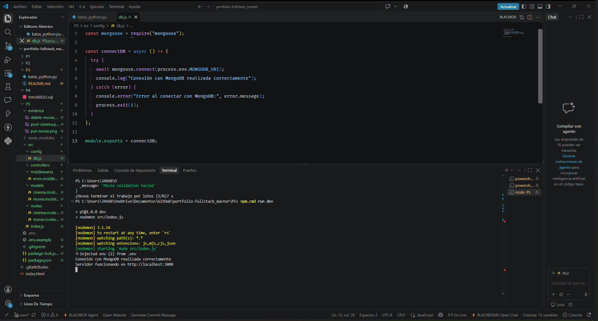
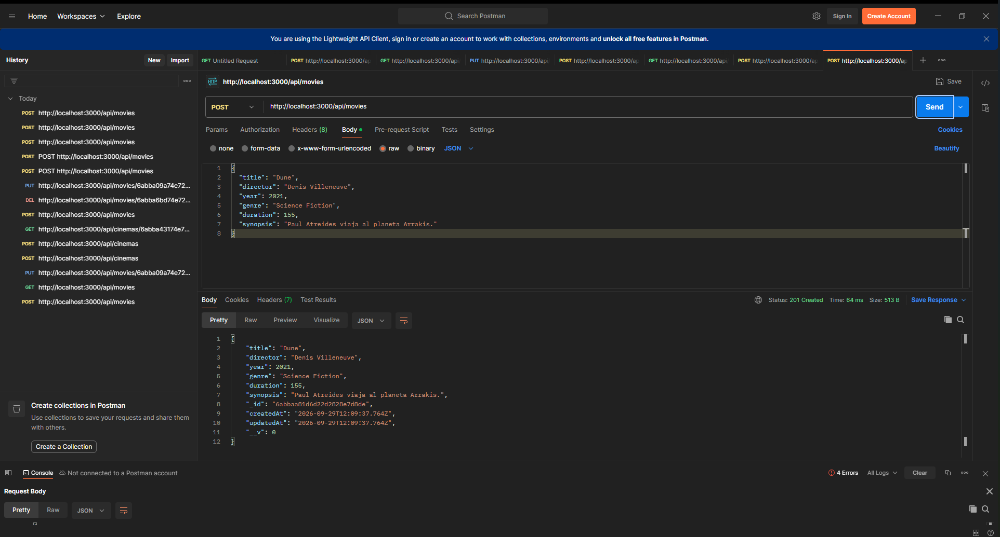
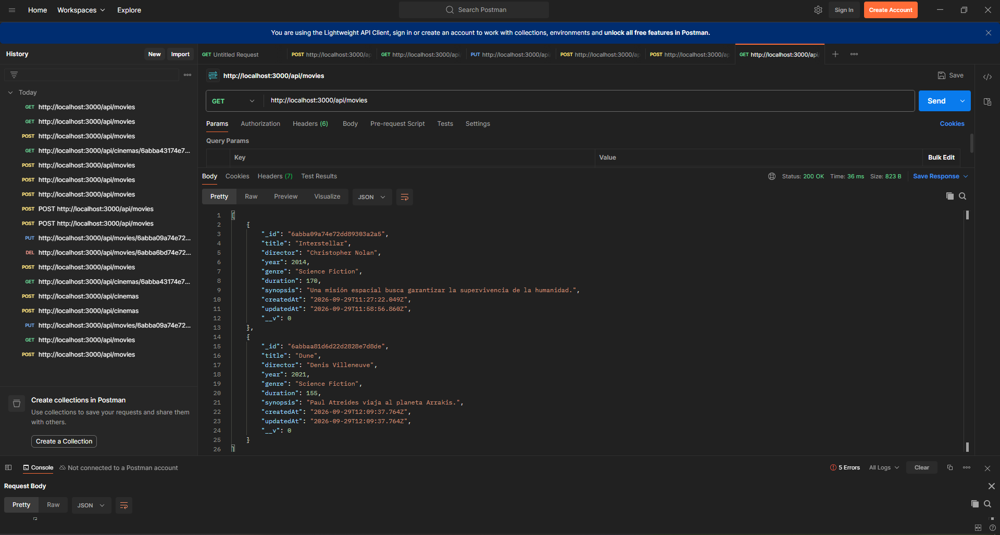
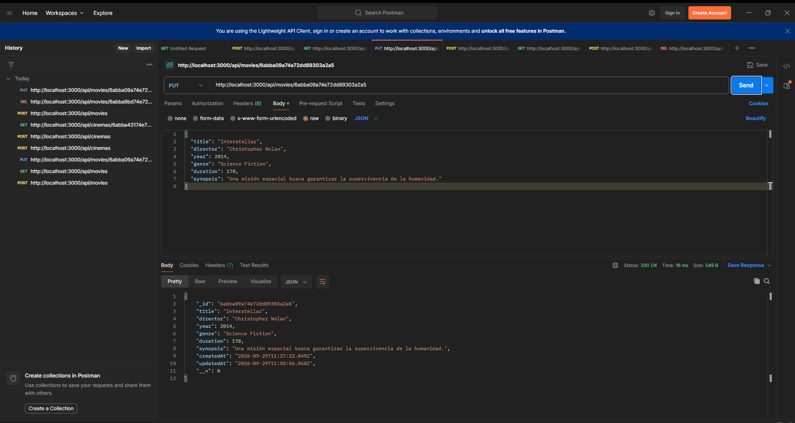
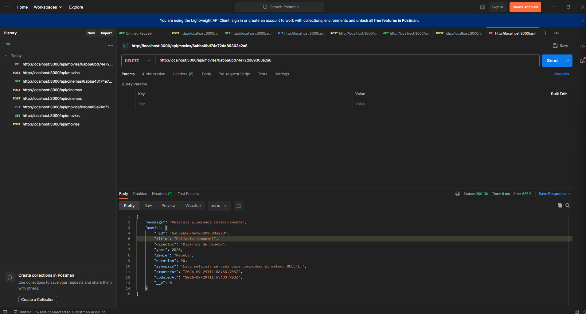
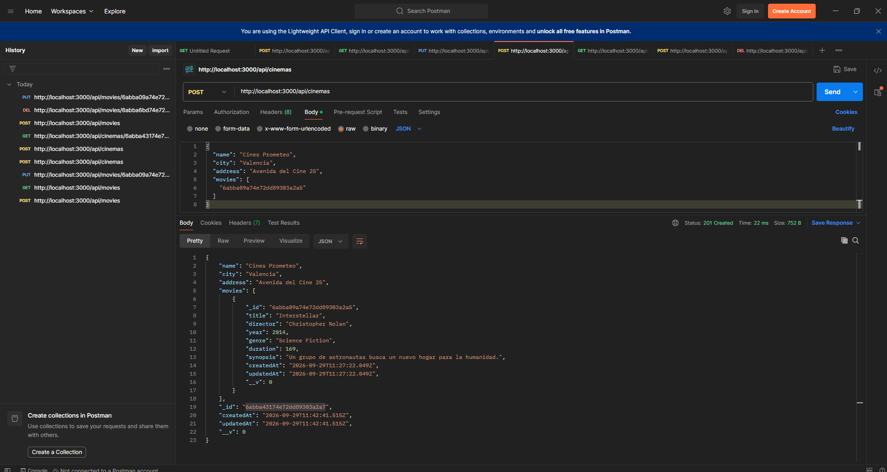
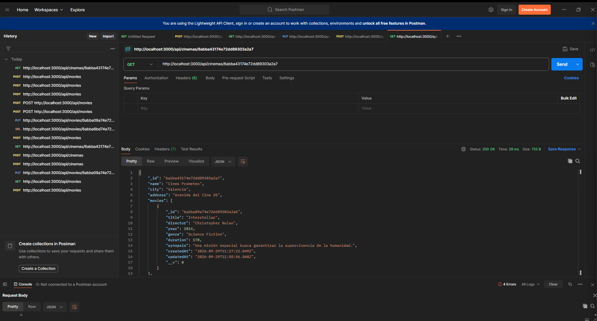
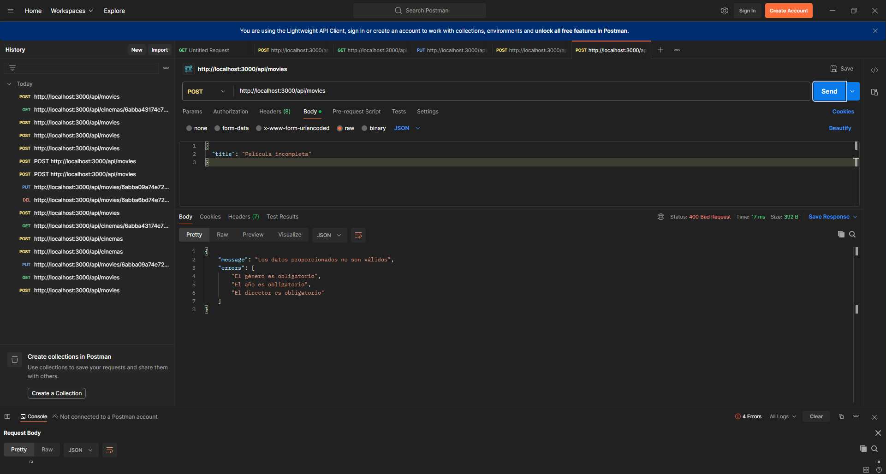

# Proyecto 5 - API REST de películas y cines

API REST desarrollada con Node.js, Express y MongoDB para gestionar películas y los cines donde se proyectan.

## Funcionalidades

- Consultar, crear, modificar y eliminar películas.
- Gestionar una colección de cines.
- Relacionar los cines con sus películas.
- Validar los datos y controlar los errores.

## Tecnologías

Node.js, Express, MongoDB, Mongoose, dotenv, Nodemon y Postman.

## Instalación

1. Instalar las dependencias con `npm install`.
2. Crear el archivo `.env` usando `.env.example`.
3. Iniciar el servidor con `npm run dev`.
4. Abrir `http://localhost:3000`.

## Rutas de películas

- `GET /api/movies`
- `GET /api/movies/:id`
- `POST /api/movies`
- `PUT /api/movies/:id`
- `DELETE /api/movies/:id`

## Rutas de cines

- `GET /api/cinemas`
- `GET /api/cinemas/:id`
- `POST /api/cinemas`
- `PUT /api/cinemas/:id`
- `DELETE /api/cinemas/:id`

## Evidencias

### Arranque del proyecto

### Crear una película

### Consultar películas

### Modificar una película

### Eliminar una película

### Crear un cine

### Consultar un cine con sus películas

### Control de errores

